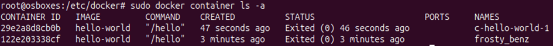
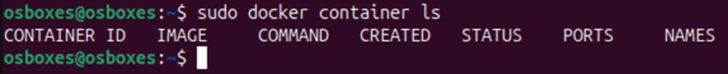
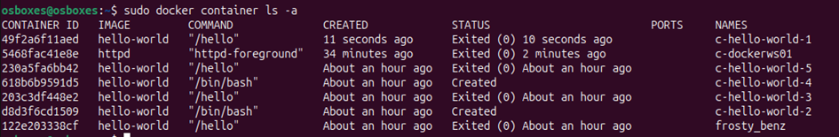
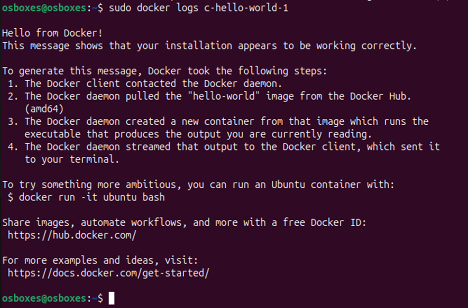
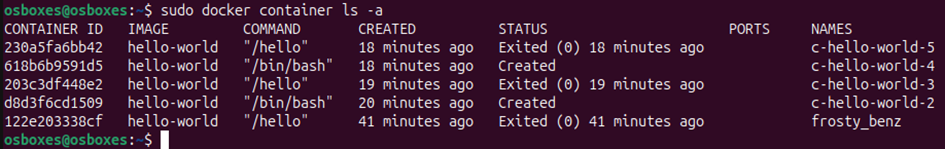

# Praktikum 1 – Nils Teipel

## Aufgabe 1.2

1. **Wie können Sie ermitteln, ob Docker installiert wurde?**
    - Command: `sudo docker version`

2. **Welche Version hat die von Ihnen installierte Docker Engine?**
    - Version: `28.1.1`

3. **Wie können Sie feststellen, ob der Docker Daemon auf dem Docker Host läuft?**
    - Command: `sudo systemctl status docker`

4. **Mit welchen Parametern wurde der Docker Daemon Prozess gestartet?**
    - Parameter: `containerd = /run/containerd/containerd.sock`

5. **Läuft der Docker Daemon auch nach dem Neustart des Docker Hosts? Erklären Sie, warum das so ist.**
    - Docker verwendet systemd, um sich als Dienst zu registrieren. Der `docker.service` ist standardmäßig so konfiguriert, dass er beim Systemstart automatisch startet.

---

## Aufgabe 1.3

1. **Erzeugen und starten Sie einen Container auf Basis des offiziellen hello-world-Images von Docker-Hub. Nennen Sie den Container „c-hello-world-1“.**
    - Command: `sudo docker container run --name c-hello-world-1 hello-world`

2. **Erzeugen und starten Sie einen zweiten Container auf Basis des offiziellen hello-world-Images von Docker-Hub.**
    - Command: `sudo docker run hello-world`

3. **Weisen Sie nach, dass beide erzeugten Container vorhanden sind.**
    - Command: `sudo docker container ls -a`  
    
---

## Aufgabe 1.4

1. **Wie viele hello-world-Images befinden sich auf Ihrem Docker Host unmittelbar nach Durchführung der Aufgabe 1.3?**
    - Command: `sudo docker images`
    - Antwort: 1 Image

2. **Welche Container laufen auf Ihrem Docker Host? Erklären Sie die Antwort!**
    - Keine, da `hello-world` sich direkt wieder beendet.  
    
   
3. **Welche Container befinden sich auf Ihrem Docker Host?**
    - Command: `sudo docker container ls -a`  
    

4. **Welche Logging-Informationen erhalten Sie zu Container „c-hello-world-01“?**
    - Command: `sudo docker logs c-hello-world-01`  
        

5. **Falls ein benötigtes Image nicht lokal (sondern auf Docker Hub) vorhanden ist, gibt es verschiedene Vorgehensweisen, einen Container auf Basis eines solchen Images zu erzeugen. Nennen Sie zwei davon! Worin liegt ein wesentlicher Unterschied zwischen den beiden Vorgehensweisen!**
    - **Impliziter Pull**:
        - Image wird automatisch vom Docker-Hub gezogen
    - **Expliziter Pull**:
        - Image wird aktiv mit `docker pull <Image>` vom Docker-Hub gezogen
    - **Unterschied**: Beim expliziten Pull erfolgt der Download bewusst und manuell, beim impliziten automatisch während des Container-Starts.

---

## Aufgabe 1.5

1. **Löschen Sie den Container „c-hello-world-01“! Verwenden dazu aber nicht den Namen des Containers, sondern seine ID! Wie lautet der Befehl? Weisen Sie nach, dass der Befehl richtig ist.**
    - Command: `sudo docker rm <Id>`  
    

2. **Versuchen Sie das Image „hello-world“ zu löschen! Was fällt Ihnen auf?**
    - Image kann nicht gelöscht werden, da es noch von Containern benutzt wird.

3. **Welche Möglichkeiten haben Sie, um das Image „hello-world“ in der aktuellen Situation zu löschen?**
    - Command: `sudo docker image rm -f <Name>`

---

## Aufgabe 1.6

1. **Erzeugen und Starten Sie einen Container, in dem ein Apache-Webserver läuft. Der Webserver (Startseite) soll vom Docker Host aus auf dem Port 8885 erreichbar sein.**
    - Hostname: `h-apache01`
    - Containername: `c-dockerws01`
    - Der Container soll im Hintergrund laufen
    - Command: `sudo docker run -d -p 8885:80 -h h-apache01 --name c-dockerws01 httpd`

2. **Wie können Sie überprüfen, dass der Hostname des Containers tatsächlich „h-apache01“ lautet?**
    - Pfad: `/var/lib/docker/containers/<Id>/hostname`

3. **In welchem Verzeichnis befindet sich die Startseite (Index-Seite) des Webservers?**
    - Command: `sudo docker exec -t <Id> bash`
    - Verzeichnis: `/usr/local/apache2/htdocs`

4. **Verändern Sie die Startseite des Webservers (index.html) so, dass ein individueller Text angezeigt wird!**
   - Command: `sudo docker cp <Id>:/usr/local/apache2/htdocs/index.html ./index.html`
   - Command: `sudo nano index.html  # Individuellen Text einfügen`
   - Command: `sudo docker cp ./index.html <Id>:/usr/local/apache2/htdocs/index.html`

5. **Stoppen und Starten Sie dann wieder den Container! Welche Index-Seite wird nun angezeigt, die ursprüngliche oder die von Ihnen individuell gestaltete? Erklären Sie das Verhalten!
   - Command: `sudo docker container stop c-dockerws01`
   - Command: `sudo docker container start c-dockerws01`
   - Es wird die geänderte Seite angezeigt. Es liegt daran, dass der Container-Layer beim stoppen gespeichert wird und der Container dan mit der aktualisierten Version hochfährt
