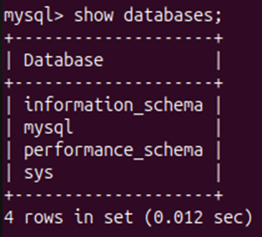
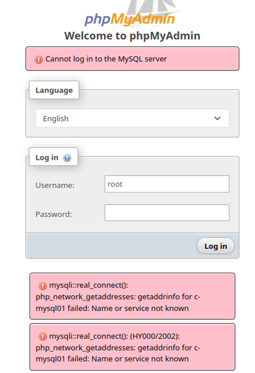
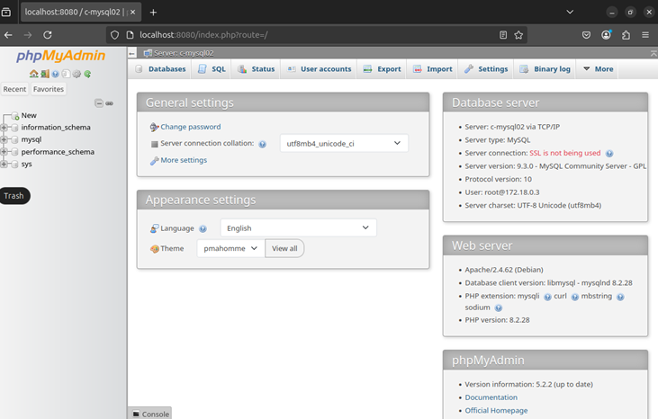
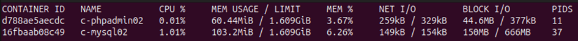
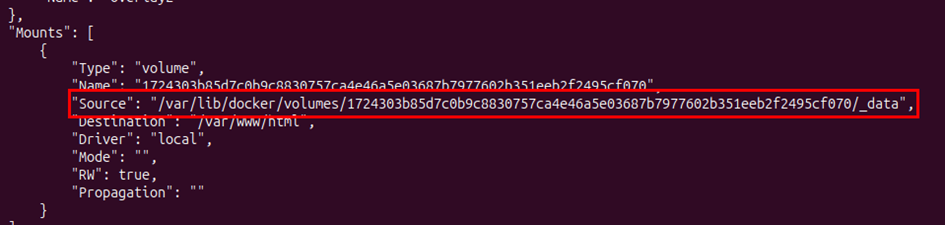
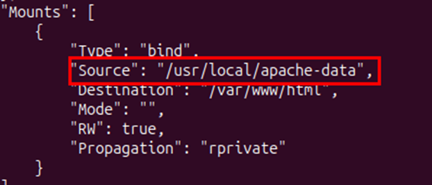
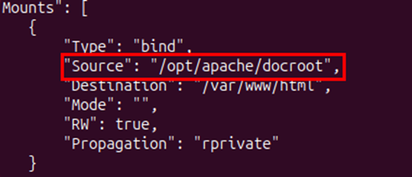

# Praktikum 2 – Nils Teipel

## Aufgabe 2.1

1. **Erzeugen und starten Sie einen MySQL-Container aus dem offiziellen MySQL-Image von Docker Hub! Der Container soll im Hintergrund aktiv sein. Wie lautet der docker-Befehl?**
    - Command: `sudo docker run -d --name c-mysql01 -e MYSQL_ROOT_PASSWORD=test mysql`

2. **Wie überprüfen Sie, ob der Datenbankserver im Container tatsächlich auf Anfragen antwortet?**
    - Auf dem Container anmelden und in die MySQL-Shell gehen.
    - Command: `sudo docker exec -it c-mysql01 mysql -uroot -p`  
    
---

## Aufgabe 2.2

1. **Erzeugen und starten Sie einen phpMyAdmin-Container aus dem offiziellen Image von Docker Hub. Wie lautet der Docker-Befehl?**
    - Command: `sudo docker run -d --name c-phpadmin01 -p 8080:80 -e PMA_HOST=c-mysql01 phpmyadmin`
    - Credentials: root (von c-mysql01)

2. **Ist der Zugriff von phpMyAdmin auf MySQL möglich? Begründen Sie Ihre Antwort.**
    - Nein, da sich die Container nicht im gleichen Docker-Netzwerk befinden und ohne Spezifikation im `bridge`-Netzwerk laufen.  
    

---

## Aufgabe 2.3

1. **Erzeugen und starten Sie einen MySQL-Container und einen phpMyAdmin-Container so, dass Sie mittels phpMyAdmin auf MySQL zugreifen können! Wie lauten die Docker-Befehle?**
    - Docker-Netzwerk erstellen:
        - `sudo docker network create net1`
    - MySQL-Container starten:
        - `sudo docker run -d --name c-mysql02 --network net1 -e MYSQL_ROOT_PASSWORD=test mysql`
    - phpMyAdmin-Container starten:
        - `sudo docker run -d --name c-myadmin02 --network net1 -e PMA_HOST=c-mysql02 -p 8080:80 phpmyadmin`  
    

---

## Aufgabe 2.4

1. **Wie können Sie Informationen über die beiden Container aus Aufgabe 2.3 gewinnen?**
    - Command: `sudo docker stats`  
    

2. **Welche Informationen sind besonders interessant?**
    - Speicher- und Netzwerkverbrauch sowie blockierte I/O-Werte.

---

## Aufgabe 2.5

1. **Ein Software-Entwickler benötigt zwei MySQL-Instanzen in jeweils einem eigenen Container sowie eine gemeinsame phpMyAdmin-Instanz zur Verwaltung. Wie setzen Sie dies um?**
    - Zwei Docker-Netzwerke erstellen:
        - `sudo docker network create net1`
        - `sudo docker network create net2`
    - Zwei MySQL-Instanzen erstellen:
        - `sudo docker run -d --name c-mysql01 --network net1 -e MYSQL_ROOT_PASSWORD=test1 mysql`
        - `sudo docker run -d --name c-mysql02 --network net2 -e MYSQL_ROOT_PASSWORD=test2 mysql`
    - phpMyAdmin-Instanz erstellen:
        - `sudo docker run -d --name c-phpadmin01 -e PMA_ARBITRARY=1 -p 8080:80 phpmyadmin`
    - phpMyAdmin-Container mit beiden Netzwerken verbinden:
        - `sudo docker network connect net1 c-phpadmin01`
        - `sudo docker network connect net2 c-phpadmin01`

---

## Aufgabe 2.6

### Teil 1

1. **Apache-Container mit anonymem Volume starten:**
    - Hostname: `ch-apache-01`
    - Containername: `c-apache-01`
    - Port: 8085
    - Command: `docker run -d --name c-apache-01 --hostname ch-apache-01 -p 8085:80 -v /var/www/html httpd`

2. **Wo befindet sich die Document-Root auf dem Host?**
    - Über `docker inspect c-apache-01` ermittelbar.  
    

3. **Bleiben die Daten erhalten, wenn der Container gelöscht wird?**
    - Ja, anonyme Volumes bleiben erhalten, es sei denn, sie werden explizit mit `docker rm -v` gelöscht.

### Teil 2

1. **Apache-Container mit benanntem Volume starten:**
    - Hostname: `ch-apache-02`
    - Containername: `c-apache-02`
    - Port: 8086
    - Command: `docker run -d --name c-apache-02 --hostname ch-apache-02 -p 8086:80 -v /usr/local/apache-data:/var/www/html httpd`

2. **Wo befindet sich die Document-Root auf dem Host?**
    - Command: `docker inspect c-apache-02`  
    

3. **Bleiben die Daten erhalten, wenn der Container gelöscht wird?**
    - Ja, benannte Volumes bleiben bestehen, bis sie manuell entfernt werden.

### Teil 3

1. **Apache-Container mit Verzeichnisbindung starten:**
    - Hostname: `ch-apache-03`
    - Containername: `c-apache-03`
    - Port: 8087
    - Command: `docker run -d --name c-apache-03 --hostname ch-apache-03 -p 8087:80 -v /opt/apache/docroot:/var/www/html httpd`
    - Command: `docker inspect c-apache-03`  
    

2. **Bleiben die Daten erhalten, wenn der Container gelöscht wird?**
    - Ja, da es sich hier um ein direkt gemountetes Host-Verzeichnis handelt, das unabhängig vom Container existiert.
