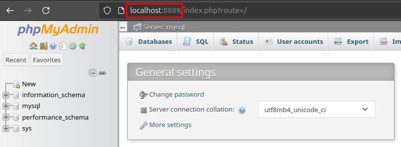
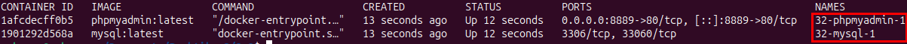
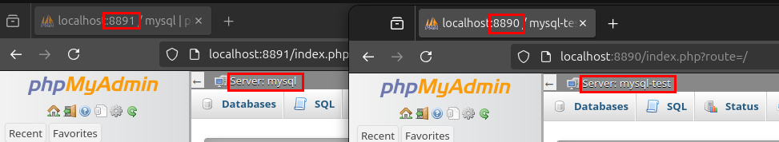
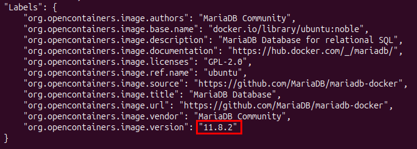

# Praktikum 2 - Nils Teipel

## Aufgabe 3.1

1. **Installieren Sie das aktuell Compose-V2-Plugin, sofern noch nicht geschehen!**

2. **Zeigen Sie, welche Compose-Version genau Sie installiert haben.**
   - Command: `docker compose version` <br>
   

---

## Aufgabe 3.2

1. **Nutzen Sie Compose um einen MySQL- und einen phpMyAdmin-Dienst zu erzeugen und laufen zu lassen! Verwenden Sie jeweils das aktuellste zur Verfügung stehende Image.**
   ```yaml
    services:                                     # Leitet die Services ein
        mysql:                                    # Service mysql
            image: mysql:latest                   # Neustes Image von mysql
            environment:                          # Leitet die Environment-Variablen ein
                MYSQL_ROOT_PASSWORD: pass         # Root-Password = pass
            networks:                             # Leitet die Netzwerke ein
                - mysql_net                       # Legt mysql auf Netzwerk mysql_net fest

        phpmyadmin:                               # Service phpmyadmin
            image: phpmyadmin:latest              # Neustes Image von phpmyadmin
            ports:                                # Leitet die Ports ein
                - "8889:80"                       # Portweiterleitung von Docker-Host :8889 zu Docker Container :80
            environment:                          # Leitet die Environment-Variablen ein
                PMA_HOST: mysql                   # phpmyadmin-Host wird auf den mysql-Service gesetzt
            networks:                             # Leitet die Netzwerke ein
                - mysql_net                       # Legt phpmyadmin auf Netzwerk mysql_net fest

        networks:                                 # Zu erstellende Netzwerke
            mysql_net:                            # Erstellt das Netzwerk mysql_net
                driver: bridge                    # Legt fest, dass das Standard Bridge-Netzwerk als Driver fungiert
    ```

2. **Weisen Sie nach, dass Sie mittels des phpMyAdmin-Dienstes auf den MySQL-Dienst zugreifen können. phpMyAdmin soll vom Docker Host aus auf Port 8889 erreichbar sein.**
   

---

## Aufgabe 3.3

1. **Was sind Vorteile der Nutzung von Compose im Vergleich zum manuellen Erstellen und Starten aller benötigten Container? Nennen Sie mindestens drei!**
    - Einfache Konfiguration und Reproduzierbarkeit
    - Zentrale Verwaltung des Stacks
    - Automatische Netzwerke und Volumes
    - 
2. **Wie heißen die durch das Projekt gestarteten Container? Wie kommt es zu den Namen?**
    - Command: `sudo docker container ls`
    
    - Der Name setzt sich aus dem Verzeichnisnamen, dem Servicenamen aus der `docker-compose.yaml` und der Nummer zusammen
   
3. **Können Sie den durch Compose erstellten Containern auch eigene Namen geben? Falls ja, wie?**
    - Ja, mit dem Keyword `container_name: <NAME>`
   
4. **Kann eine Startreihenfolge der Container angeben werden?**
    - Ja, mit dem Keyword `depends_on: <SERVICENAME>`
    - So startet der Service erst, wenn der andere Service gestartet ist.
   
5. **Ist es erforderlich, ein oder mehrere Netzwerke explizit anzulegen? Erläutern Sie Ihre Antwort!**
    - Nein ist es nicht. Compose erstellt so ein Standardnetzwerk mit dem alle Services in der Compose-Datei verbunden werden.
    - Es kann trotzdem gute Praxis sein manuell Netze anzulegen wenn man seine Architektur strukturierter haben möchte.
   
6. **Die Übergabe eines Passwortes im Klartext in einer Umgebungsvariablen ist aus Sicherheitssicht bedenklich. Wie kann man sicherheitsrelevante Informationen besser an Dienste bzw. Container übergeben?**
   - Mit Secrets, diese werden in einer externen Datei gespeichert
   ```yaml
    services:
        testsecret:
            image: alpine
            secrets:
              - passwort
    secrets:
        passwort:
            file: ./geheim.txt
    ```
---

## Aufgabe 3.4

1. **Stellen Sie sich vor, ein Software-Entwickler benötigt zum Testen sowohl die Version 8.0 als auch die aktuelle Version von MySQL! Ihre Aufgabe besteht darin, die beiden Datenbanksysteme als Dienste zur Verfügung zu stellen. Erstellen Sie dazu mit Docker-Compose zwei Projekte (unterschiedliche compose.yml Dateien), sodass Folgendes gilt:**
    - Die beiden Datenbanksysteme laufen in jeweils unterschiedlichen Containern.
    - Die beiden Datenbanksysteme laufen gleichzeitig, auf beide Systeme kann also parallel zugegriffen werden.
    - Die beiden MySQL-Dienste sind auf Netzebene voneinander getrennt.
    - Zur Administration beider Datenbanksysteme soll PHPMyAdmin jeweils als separater Dienst zur Verfügung gestellt werden (jedes MySQL DB-Managementsystem kann durch seine zugehörige PHPMyAdmin-Instanz administriert werden).<br>

   **docker-compose.yaml für das Testsystem**
    ```yaml
    services:                            
     mysql-test:                           
         image: mysql:8.0          
         environment:                 
             MYSQL_ROOT_PASSWORD: test
         networks:                    
             - mysql_test_net
                 
     phpmyadmin:                      
         image: phpmyadmin:latest     
         ports:                       
             - "8890:80"              
         environment:                 
             PMA_HOST: mysql-test          
         networks:                    
             - mysql_test_net              
     networks:                        
         mysql_test_net:                   
             driver: bridge
   ```  
   
    **docker-compose.yaml für das Produktivsystem** 
    ```yaml
    services:                            
     mysql:                           
         image: mysql:latest        
         environment:                 
             MYSQL_ROOT_PASSWORD: test
         networks:                    
             - mysql_net
                 
     phpmyadmin:                      
         image: phpmyadmin:latest     
         ports:                       
             - "8891:80"              
         environment:                 
             PMA_HOST: mysql         
         networks:                    
             - mysql_net              
     networks:                        
         mysql_net:                   
             driver: bridge
   ```  
   
    **Beide Instanzen sind einzeln aufrufbar:**<br>
    

---

## Aufgabe 3.5

1. **Stellen Sie sich vor, ein Software-Entwickler benötigt zum Testen sowohl die Version 8.0 als auch die aktuelle Version von MySQL! Ihre Aufgabe besteht darin, die beiden Datenbanksysteme als Dienste zur Verfügung zu stellen. Erstellen Sie dazu mit Docker-Compose ein Projekt, sodass Folgendes gilt:**
   - Die beiden Datenbanksysteme laufen in jeweils unterschiedlichen Containern.
   - Die beiden Datenbanksysteme laufen gleichzeitig, auf beide Systeme kann also parallel zugegriffen werden.
   - Die beiden MySQL-Services sind auf Netzebene voneinander getrennt.
   - Zur Administration beider Datenbanksysteme soll ein PHPMyAdmin-Dienst genutzt werden (beide DB-Managementsysteme sind über denselben PHPMyAdmin-Dienst administrierbar).
   - phpMyAdmin soll vom Docker Host aus auf Port 8889 erreichbar sein.
   - Die eingerichteten Dienste sollen auch bei Neustart des Docker Hosts wieder laufen, ohne dass sie explizit gestartet werden müssen.
   - Das Verzeichnis /var/lib/mysql des jeweiligen MySQL-Dienstes soll persistent auf dem Docker Host gespeichert werden!
   - Im Compose-File dürfen keine Passwörter im Klartext erscheinen. 

    **docker-compose.yaml**
    ```yaml
    services:
        mysql-test:
            image: mysql:8.0
            environment:
                MYSQL_ROOT_PASSWORD_FILE: /run/secrets/mysql_test_root_password
            networks:
                - mysql_test_net
            volumes:
                - mysql_test_vol:/var/lib/mysql
            restart: always
            secrets:
                - mysql_test_root_password
          
        mysql:
            image: mysql:latest
            environment:
                MYSQL_ROOT_PASSWORD_FILE: /run/secrets/mysql_root_password
            networks:
                - mysql_net
            volumes:
                - mysql_vol:/var/lib/mysql
            restart: always
            secrets:
                - mysql_root_password
   
        phpmyadmin:
            image: phpmyadmin:latest
            ports:
                - "8889:80"
            environment:
                PMA_HOSTS: "mysql-test,mysql"
            depends_on:
                - mysql-test
                - mysql
            networks:
                - mysql_test_net
                - mysql_net
            restart: always
   
   networks:
      mysql_test_net:
          driver: bridge
      mysql_net:
          driver: bridge
   
   volumes:
      mysql_test_vol:
      mysql_vol:
   
   secrets:
      mysql_test_root_password:
          file: ./mysql_test_root_password.txt
      mysql_root_password:
          file: ./mysql_root_password.txt
    ```

---

## Aufagbe 3.6

1. **Welche mariadb-Version erhalten Sie, wenn Sie das Image mit dem Tag „11“ herunterladen? Nennen Sie die genaue Versionsnummer!**
   - Command: `sudo docker image pull mariadb:11`
   - Command: `sudo docker image inspect mariadb:11` <br>
   
   - Hier wird das neueste Image der 11er-Reihe heruntergeladen
   
2. **Welche mariadb-Version erhalten Sie, wenn Sie das Image mit dem Tag „latest“ herunterladen? Nennen Sie die genaue Versionsnummer!** 
   - Command: `sudo docker image pull maridb:latest`
   - Command: `sudo docker image inspect mariadb:latest`
   - Hier wird die gleiche Version angezeigt