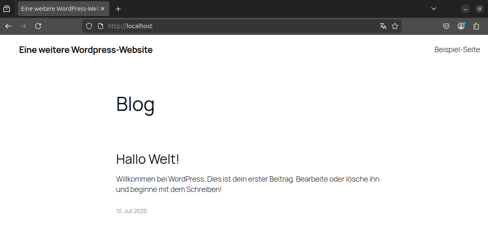
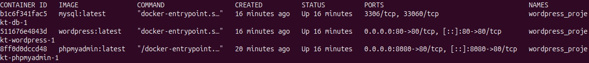
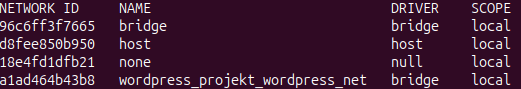
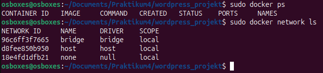
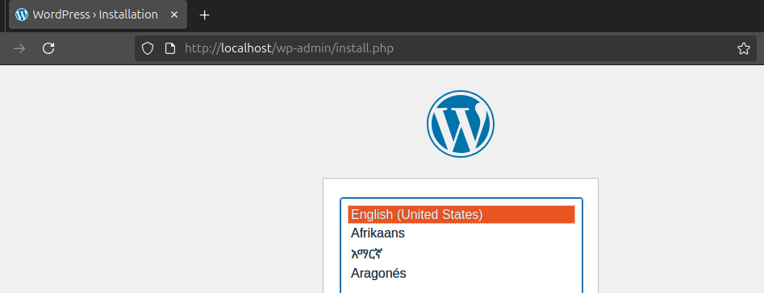
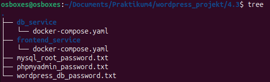
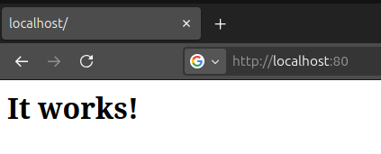
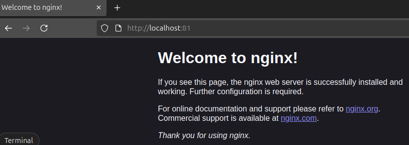
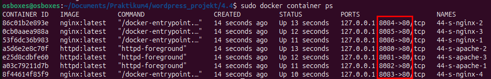
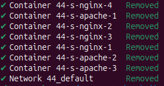

# Praktikum 4 - Nils Teipel

## Aufgabe 4.1

**Wordpress-Projekt: Stellen Sie mithilfe von docker compose einen Wordpress-Service bereit! Verwenden Sie dazu ein Compose-File! Beachten Sie dabei Folgendes:** <br>
    - Der Wordpress-Service wird initial so bereitgestellt, dass eine Installation von Wordpress erfolgen kann. <br>
    – Das Verzeichnis /var/www/html des Wordpress-Services soll persistent auf dem Docker Host außerhalb des Verzeichnisses „/var/lib/docker“ gespeichert werden! <br>
    – Wordpress soll MySQL als Datenbanksystem nutzen. MySQL soll als Service implementiert werden. <br>
    – Das Verzeichnis /var/lib/mysql des MySQL-Services soll persistent auf dem Docker Host außerhalb des Verzeichnisses „/var/lib/docker“ gespeichert werden! <br>
    – phpMyAdmin wird als Service bereitgestellt, über den das MySQL-Datenbanksystem bei Bedarf verwaltet werden kann. <br>
    – Im Compose-File stehen keine Passwörter. <br>

1. **Starten Sie das Wordpress-Projekt!** <br>

    - Password-Secret Files erstellen
      - `echo "mysql_pw" > mysql_root_password.txt`
      - `echo "wordpress_pw" > wordpress_db_password.txt`
      - `echo "phpmyadmin_pw" > phpmyadmin_password.txt`

   **Compose-File erstellen**
```yaml
   services:
    db:
      image: mysql:8.0
      environment:
          MYSQL_ROOT_PASSWORD_FILE: /run/secrets/mysql_root_password
          MYSQL_DATABASE: wordpress_db
          MYSQL_USER: wordpress_user
          MYSQL_PASSWORD_FILE: /run/secrets/wordpress_db_password
      volumes:
        - db_data:/var/lib/mysql
      networks:
        - wordpress_net
      secrets:
        - mysql_root_password
        - wordpress_db_password
          
    wordpress:
      image: wordpress:latest
      ports:
        - "80:80"
      environment:
        WORDPRESS_DB_HOST: db:3306
        WORDPRESS_DB_USER: wordpress_user
        WORDPRESS_DB_PASSWORD_FILE: /run/secrets/wordpress_db_password
        WORDPRESS_DB_NAME: wordpress_db
      volumes:
        - wordpress_data:/var/www/html
      networks:
        - wordpress_net
      secrets:
        - wordpress_db_password
          
    phpmyadmin:
      image: phpmyadmin:latest
      ports:
        - "8080:80"
      environment:
        PMA_HOST: db
        PMA_USER: root
        PMA_PASSWORD_FILE: /run/secrets/phpmyadmin_password
        PMA_ARBITRARY: 0
      networks:
        - wordpress_net
      secrets:
        - phpmyadmin_password
          
  networks:
    wordpress_net:
      driver: bridge
          
  volumes:
    db_data:
    wordpress_data:
          
  secrets:
    mysql_root_password:
      file: ./mysql_root_password.txt
    wordpress_db_password:
      file: ./wordpress_db_password.txt
    phpmyadmin_password:
      file: ./phpmyadmin_password.txt
```

2. **Verbinden Sie sich mit dem Wordpress-Service und führen Sie eine Installation von Wordpress durch! Danach sollte der Service eine Seite anzeigen, in der unter anderem „Eine weitere Wordpress-Website“ steht.** <br>
    

3. **Geben Sie an, welche Container und Netze durch docker compose angelegt wurden!** <br>
    - Command: `sudo docker ps` <br>
    
    - Command: `sudo docker network ls` <br>
    

4. **Fahren Sie das Wordpress-Projekt herunter! Die auf dem Docker Host persistent abgelegten Daten dürfen dabei nicht gelöscht werden.** <br>
    - Command: `sudo docker compose down`

5. **Weisen Sie nach, dass alle Container und Netze, die im Rahmen des Projektes angelegt wurden, nicht mehr vorhanden sind!** <br>
   

6. **Führen Sie die notwendigen Aktionen durch, sodass nach dem erneuten Starten des Projektes mit „docker compose up“ der Wordpress-Service wieder mit der Installationsoption antwortet!** <br>
    - Dafür müssen die benannten Volumes gelöscht werden
      - Command: `sudo docker volume rm wordpress_projekt_wordpress_data`
      - Command: `sudo docker volume rm wordpress_projekt_db_data`
    - Wordpress antwortet wieder mit der Installationsoption: <br>
    

---

## Aufgabe 4.2

1. ** Können Sie das Wordpress-Projekt so konfigurieren und starten, dass beim geeigneten Herunterfahren auch die persistenten Daten gelöscht werden, der Schritt (6) damit unnötig ist? Falls ja, beschreiben Sie wie!**
    - Das geht durch das Benutzen von anonymen Volumes
    ```yaml
    # Nur die geänderten Zeilen
    services:
      db:
        volumes:
          - /var/lib/mysql
      
      wordpress:
        volumes:
          - /var/www/html
   
    volumes:
      # Dieser Teil wurde komplett entfernt
    ```

---

## Aufgabe 4.3

1. **Stellen Sie mithilfe von docker compose einen Wordpress-Service wie in Aufgabe 4.1 beschrieben bereit! Verwenden Sie allerdings je Service ein Compose-File.**
    - Folgende Ordnerstruktur: <br>
    
    - Compose-Datei für die Datenbank:
   ```yaml
    services:
        db:
            image: mysql:latest
            environment:
                MYSQL_ROOT_PASSWORD_FILE: /run/secrets/mysql_root_password
                MYSQL_DATABASE: wordpress_db
                MYSQL_USER: wordpress_user
                MYSQL_PASSWORD_FILE: /run/secrets/wordpress_db_password
            volumes:
                - db_data:/var/lib/mysql
            networks:
                - wordpress_net
            secrets:
                - mysql_root_password
                - wordpress_db_password

    networks:
        wordpress_net:
            driver: bridge
            name: wordpress_global_net

    volumes:
        db_data:

    secrets:
        mysql_root_password:
            file: ../mysql_root_password.txt
        wordpress_db_password:
            file: ../wordpress_db_password.txt
    ```
   - Compose-Datei für Frontend-App
   ```yaml
    services:
        wordpress:
            image: wordpress:latest
            ports:
                - "80:80"
            environment:
                WORDPRESS_DB_HOST: db:3306
                WORDPRESS_DB_USER: wordpress_user
                WORDPRESS_DB_PASSWORD_FILE: /run/secrets/wordpress_db_password
                WORDPRESS_DB_NAME: wordpress_db
            volumes:
                - wordpress_data:/var/www/html
            networks:
                - wordpress_net
            secrets:
                - wordpress_db_password

        phpmyadmin:
            image: phpmyadmin:latest
            ports:
                - "8080:80"
            environment:
                PMA_HOST: db
                PMA_USER: root
                PMA_PASSWORD_FILE: /run/secrets/phpmyadmin_password
            networks:
                - wordpress_net
            secrets:
                - phpmyadmin_password

    networks:
        wordpress_net:
            external: true
            name: wordpress_global_net

    volumes:
        wordpress_data:

    secrets:
        wordpress_db_password:
            file: ../wordpress_db_password.txt
        phpmyadmin_password:
          file: ../phpmyadmin_password.txt
    ```
   
---

## Aufgabe 4.4

**Webserver-Projekt: Stellen Sie mithilfe von docker compose ein Webserver-Infrastruktur auf Basis von Docker bereit! Verwenden Sie dazu ein Compose-File!**

Beachten Sie dabei Folgendes:
- Die Webserver-Infrastruktur stellt zwei Webserver bereit.
- Der erste Webserver ist eine Apache-Webserver.
- Der zweite Webserver ist eine nginx-Webserver.
- Verwenden Sie jeweils die aktuellen offiziellen Images.
- Beide Server zeigen die Default-Startseite (index.html) an, eine Anpassung ist nicht erforderlich.
- Beide Webserver sollen parallel laufen und vom Docker Host erreichbar sein.
- Die Webserver sollen nach einem Neustart des Docker Hosts automatisch gestartet werden.  
- Die Namen der Services lauten s-apache und s-nginx.
- Die Container-Namen lauten c-apache und c-nginx.
- Das Compose-File liegt im Unterverzeichnis „webserver“ des Home-Verzeichnisses des Benutzers. Aus diesem Verzeichnis wird das Projekt auch gestartet.
- Der Projektname lautet p_webserver.

**Compose-File:
```yaml
services:
  s-apache:
    image: httpd:latest
    container_name: c-apache
    ports:
      - "80:80"
    restart: always

  s-nginx:
    image: nginx:latest
    container_name: c-nginx
    ports:
      - "81:80"
    restart: always
```


---

## Aufgabe 4.5

Betrachten Sie die Infrastruktur aus Aufgabe 4.4. <br>

Beantworten Sie die folgenden Fragen:
1. Ist es möglich, das Projekt mit docker compose auch so hochzufahren, dass drei Apache- und vier nginx-Container gestartet werden? Falls ja, welche Anpassungen müssen Sie in Bezug auf Ihre Lösung aus Aufgabe 4.4 vornehmen?
   - Mit der Option `--scale <Servicename>=<N>` beim Startbefehl
   - Dazu muss der `ports` Abschnitt in der Compose angepasst werden, da ihm ein Port-Bereich gegeben werden muss:
    ```yaml
    # Service: s-apache
    ports:
      - target: 80
        host_ip: 127.0.0.1
        published: 8080-8082
        protocol: tcp
   
    # Service: s-nginx
    ports:
      - target: 80
        host_ip: 127.0.0.1
        published: 8083-8086
        protocol: tcp
    ```
   - Außerdem muss Container-Name entfernt werden.
   - Starten mit Command: `sudo docker compose up -d --scale s-apache=3 --scale s-nginx=4`

2. Wie können Sie ggf. nachweisen, dass Ihr Projekt die geforderten sieben Container gestartet hat und diese auf Anfragen antworten!
    - Command: `sudo docker container ps` <br>
    
   
3. Fahren Sie das Projekt auf geeignete Weise herunter! Welche Container, Images, Volumes und Netze werden dadurch gelöscht?
    - Command: `sudo docker compose down` <br>
    
    - Es werden die 7 Container und das Netz gelöscht