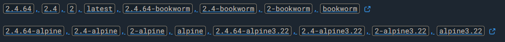
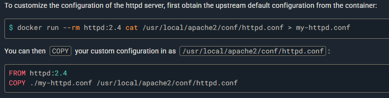
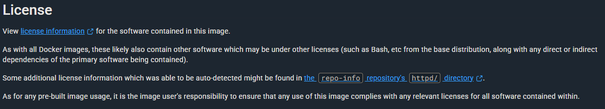
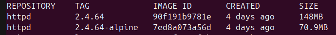
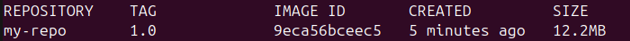
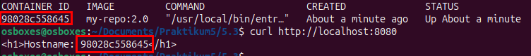
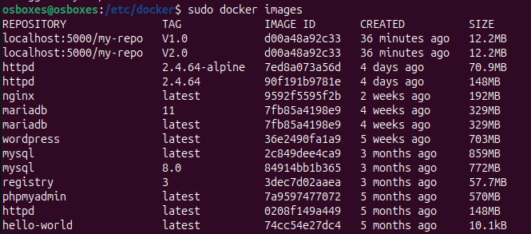
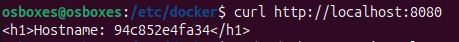
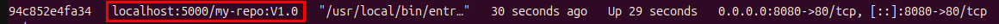

# Praktikum 5 - Nils Teipel

## Aufgabe 5.1

**Sie möchten einen Webserver (httpd) auf Basis von Apache2 in einem Container als Dienst bereitstellen. Suchen Sie dazu auf Docker Hub nach offiziellen passenden Images und Informationen und finden Sie Antworten zu folgenden Fragen (ohne Download von Images)!**

1. Welche Varianten mit welchen Tags stehen zur Auswahl? <br>
   

2. Welche Informationen können Sie auf Docker Hub sowie über dort angegebene Links über Images erhalten?
    - Vulnerabilities
    - OS-Architecture
    - Size
   
3. Gibt es Hinweise zur Nutzung der Images? Falls ja, erläutern Sie diese!
    - Wie das Image ohne Dockerfile als Container gestartet werden kann: `docker run -dit --name my-apache-app -p 8080:80 -v "$PWD":/usr/local/apache2/htdocs/ httpd:2.4`
    - Wie das Image über eine Dockerfile eingebunden werden kann:
    ```dockerfile
    FROM httpd:2.4
    COPY ./public-html/ /usr/local/apache2/htdocs/
    ```
    - Wie die Konfiguration des Images geändert werden kann: <br>
    
   
4. Gibt es Informationen zum Thema Lizenzen? Falls ja, erläutern Sie diese! <br>
    

5. Gibt es Angaben zu den Dockerfiles, die zur Erzeugung der Images verwendet
   wurden bzw. verwendet werden können? Wenn ja, erläutern Sie diese?
    - Über die Tag-Links kommt man zu der GitHub-Docker Seiten, wo man auch die entsprechenden Dockerfiles findet, mit denen die Images erzeugt werden

---

## Aufgabe 5.2

**Sie möchten einen Webserver auf Basis von Apache2 (httpd) in einem Container als Dienst bereitstellen. Auf Docker Hub existieren zwei Images, die für Sie interessant sind: Eine allgemeine Linux-Variante und eine Variante auf Basis von Alpine Linux.**

1. Laden Sie die aktuellste Version (verwenden Sie nicht „latest“) herunter, die nicht auf Alpine Linux basiert, ohne einen Container zu starten.
    - Command: `sudo docker image pull httpd:2.4.64`

2. Laden Sie die aktuellste Version (verwenden Sie nicht „latest“) herunter, die auf Alpine Linux basiert, ohne einen Container zu starten.
    - Command: `sudo docker image pull httpd:2.4.64-alpine` <br>
    
3. Finden Sie alle möglichen Informationen über die beiden Images heraus, ohne einen Container auf Basis der Images zu erzeugen bzw. zu starten. Welche docker Kommandos können Ihnen dabei helfen?
    - Command: `sudo docker images` -> Repository, Tag, ImageId, Created, Size
    - Command: `sudo docker image history httpd:2.4.64` -> Dockerfile
    - Command: `sudo docker image inspect httpd:2.4.64` -> Detaillierte Infos über fast alles

---

## Aufgabe 5.3

1. **Schreiben Sie ein Dockerfile, das auf Basis von Alpine Linux ein Image mit einem Apache Web-Server erzeugt! Berücksichtigen Sie dabei Folgendes:**
    <br>a. Der Container soll beim Start eine Index-Datei „index.html“ in der Document-Root erzeugen, die den Hostnamen (des Containers, nicht des Docker Hosts!) ausgibt.
    <br>b. Halten sie das Image möglichst klein und vermeiden Sie „unnötigen Ballast“!
    <br>c. Verwenden Sie als Basis-Image das reine Alpine-Linux-Image (ohne installierten Apache2-Server)!
    
   ```dockerfile
    FROM alpine:latest
    RUN apk add --no-cache apache2 && mkdir -p /var/www/localhost/htdocs
    COPY entrypoint.sh /usr/local/bin/entrypoint.sh
    RUN chmod +x /usr/local/bin/entrypoint.sh
    EXPOSE 80
    ENTRYPOINT ["/usr/local/bin/entrypoint.sh"]
    CMD ["httpd", "-D", "FOREGROUND"]
   ```
   ```shell
    !#/bin/sh   
    echo "<h1>Hostname: $(hostname)</h1>" > /var/www/localhost/htdocs/index.html
    exec "$@"
   ```
   
2. Erzeugen Sie ein Image unter Verwendung des zuvor geschriebenen Dockerfiles!
    - Command: `sudo docker build -t my-repo:1.0 .` <br>
    

3. Beschreiben Sie, was Sie unternommen haben, um das Image möglichst kleinzuhalten!
    - Alpine-Linux verwendet, da es für Container optimiert ist
    - `--no-cache` bei der Installation angewendet
    - Run-Befehle kombiniert, da sonst für jeden Zeile ein Layer angelegt wird

4. Starten Sie einen Container unter Verwendung des generierten Images! Weisen Sie nach, dass der Webserver auf der Startseite tatsächlich den Hostnamen des Containers anzeigt!
    - Command: `sudo docker run -d -p 8080:80 --name my-container my-repo:1.0`
    - Command: `curl http://localhost:8080` <br>
    

---

## Aufgabe 5.4

1. Setzen Sie eine eigene (private) Registry auf! Verwenden Sie dazu das aktuelle offizielle Image „registry“ von Docker Hub! Berücksichtigen Sie dabei Folgendes:
    <br>a. Die Registry soll nach einem Neustart des Docker Hosts automatisch starten.
    <br>b. Die Images in der Registry sollen persistent auf dem Docker Host abgelegt werden.
    - Command: `sudo docker run -d -p 5000:5000 --restart always --name my-registry -v ~/docker-registry-data:/var/lib/registry registry:3`

2. Legen Sie das in Aufgabe 5.3 erzeugte Image in Ihrer privaten Registry ab, einmal mit dem Tag „V01“ und einmal mit dem Tag „V02“.
    - Commands:
    ```shell
    sudo docker tag my-repo:1.0 loclahost:5000/my-repo:V1.0
    sudo docker tag my-repo:1.0 loclahost:5000/my-repo:V2.0
    ```
    - Einfügen von ``{"insecure-registries": ["localhost:5000"]}`` in die `/etc/docker/deamon.json` 
    - Neustart per `sudo systemcrl restart docker`
    - Commands:
    ```shell
    sudo docker push localhost:5000/my-repo:V1.0
    sudo docker push localhost:5000/my-repo:V1.0
    ``` 

3. Löschen Sie die lokal vorhandene Version Ihres Images mit dem Tag „V01“ und weisen Sie nach, dass das Image nicht mehr lokal vorhanden ist!
    - Command: `sudo docker image rm my-repo:1.0` -> Image ist nicht mehr vorhanden: <br>
    
   
4. Starten Sie einen Container auf Basis Ihres neu generierten und in der privaten Registry abgelegten Images mit dem Tag „V01“! Weisen Sie nach, dass das Image tatsächlich von der Registry und nicht aus dem lokalen Speicher geladen wurde.
    - Command: `sudo docker run -d -p 8080:80 --name test localhost:5000/my-repo:V1.0` <br>
    
    - Command: `sudo docker images` -> Es ist zu sehen, dass das Image aus der Registry geladen wurde <br>
    