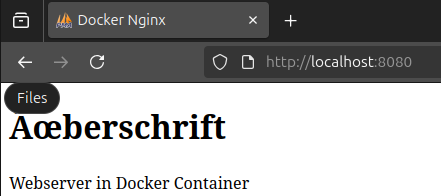
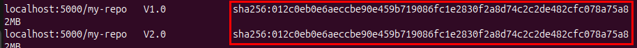
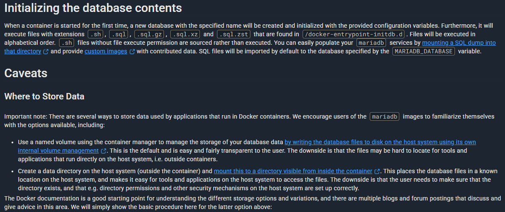
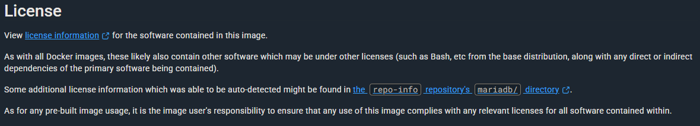
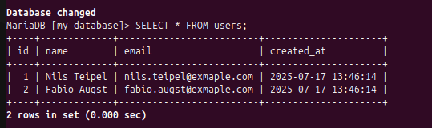
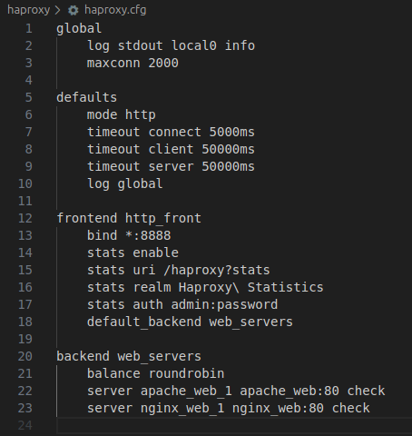
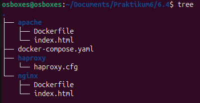

# Praktikum 6 - Nils Teipel

## Aufgabe 6.1

**Erzeugen Sie mit Hilfe eines Dockerfiles ein eigenes Image für einen Dienst (Container) Ihrer Wahl. Wählen Sie das zu erzeugende Image so, dass das Dockerfile mindestens die folgenden Schlüsselwörter verwendet:**
``FROM, RUN, COPY, ENTRYPOINT, CMD, EXPOSE, VOLUME`` 

````dockerfile
FROM nginx:alpine                                   # Image soll auf nginx:alpine basieren
RUN apk update                                      # Sämtliche Pakete beim Bauen des Images updaten
COPY index.html /usr/share/nginx/html/index.html    # Custom Startseite in das Image leiden
VOLUME ["/var/log/nginx"]                           # Ein Volume übergeben, was für die Logs zuständig sein soll
EXPOSE 80                                           # Container des Images sollen intern auf Port 80 laufen
ENTRYPOINT ["nginx"]                                # Primärer Befehl, der nicht überschrieben werden kann (von docker run o.ä.)
CMD ["-g", "daemon off"]                            # Nginx läuft im Vordergrund, da ein Container sich beendet sobald der Hauptprozess endet
````
````html
<!DOCTYPE html>
<head>
    <title>Docker Nginx</title>
</head>
<body>
    <h1>Überschrift</h1>
    <p>Webserver in Docker Container</p>
</body>
</html>
````
````shell
sudo docker build -t my-nginx .
sudo docker run -d -p 8080:80 --name my-webserver my-nginx
````


---

## Aufgabe 6.2

**Erläutern Sie die Informationen, die Sie auf Docker Hub zum MariaDB-Image(https://hub.docker.com/_/mariadb) finden. Gehen Sie dabei insbesondere auf folgende Punkte ein!**
1. Wie viele sogenannte „Supported Tags“ sind aufgeführt?
    - 52
   
2. Wie können Sie feststellen, ob zwei Images mit unterschiedlichen Tags inhaltlich gleich sind?
    - Mit Command: `sudo docker images --digests` Digest repräsentiert den Inhalt des Images als ID <br>
    
   
3. Wie viele inhaltlich unterschiedliche Versionen (also verschiedene Images) werden durch die aufgeführten Tags angeboten?
    - 10 (denke ich, da sie so auf der Seite geordnet sind. Ich werde aber nicht auf alle testen)

4. Wie können Sie MariaDB konfigurieren, falls Sie das neueste Image verwenden?
    - Mit Environment-Variablen
    - Mit einer Config-File
    - Per Parameter im Docker-Run Befehl oder über Compose
   
5. Welche Informationen gibt es zum Thema Speicherung von Daten?
    

6. Wie viele Umgebungsvariablen sind aufgeführt? Nennen Sie drei davon und erläutern Sie diese!
    - Siehe alle Umgebungsvariablen: https://mariadb.com/kb/en/mariadb-server-docker-official-image-environment-variables/
    - `MARIADB_USER`: Benutzername
    - `MARIADB_PASSWORD`: Passwort für den Benutzer
    - `MARIADB_DATABASE`: Name der Datenbank

7. Welche Informationen finden Sie zum Thema Lizenzen? <br>
   

8. Es werden drei Websites empfohlen, die man bei Problemen mit dem Image aufrufen kann. Welche sind dies?
    - https://dba.stackexchange.com/questions/tagged/docker+mariadb
    - https://mariadb.com/kb/en/docker-and-mariadb/
    - https://mariadb.com/kb/en/getting-help-with-mariadb/

9. Gibt es Informationen dazu, wie eine MySQL-Datenbank gesichert und wieder hergestellt werden kann? Falls ja, erläutern Sie diese kurz!
    - MariaDB wurde von den gleichen Entwicklern wie MySQL entwickelt
    - Hohe Kompatibilität und exakte Syntax wie MariaDB

10. Wie können Sie sich das Dockerfile anzeigen lassen, das zur Generierung eines Images mit einem bestimmten Tag verwendet wurde? 
    - Man klickt auf den Tag, darüber kommt man auf die Github-Seite, wo auch die entsprechenden Dockerfiles liegen

---

## Aufgabe 6.3

**Erzeugen Sie ein Compose-File mit einem Service Ihrer Wahl, in dem ein Image erzeugt wird. Dokumentieren SIe die notwendigen Schritte und verwendeten Dateien.**

````dockerfile
FROM mariadb:latest
COPY init.sql /docker-entrypoint-initdb.d/
````

````shell
echo "mariadb_pw" > mariadb_root_password.txt
````

````yaml
services:
  mariadb:
    build:
      context: ./mariadb
      dockerfile: Dockerfile
    image: my-mariadb:1.0
    container_name: my-mariadb-container
    environment:
      MARIADB_ROOT_PASSWORD_FILE: /run/secrets/mariadb_root_password
    ports:
      - "3306:3306"
    volumes:
      - mariadb_data:/var/lib/mysql
    secrets:
      - mariadb_root_password

secrets:
  mariadb_root_password:
    file: ./mariadb_root_password.txt

volumes:
  mariadb_data:
````

````sql
CREATE DATABASE IF NOT EXISTS my_database;
CREATE USER IF NOT EXISTS 'myuser'@'%' IDENTIFIED BY 'mypassword';
GRANT ALL PRIVILEGES ON my_database.* TO 'myuser'@'%';
FLUSH PRIVILEGES;

USE my_database;
CREATE TABLE IF NOT EXISTS users (
    id INT AUTO_INCREMENT PRIMARY KEY,
    name VARCHAR(255) NOT NULL,
    email VARCHAR(255) UNIQUE NOT NULL,
    created_at TIMESTAMP DEFAULT CURRENT_TIMESTAMP
);

INSERT INTO users (name, email) VALUES ('Nils Teipel', 'nils.teipel@example.com');
INSERT INTO users (name, email) VALUES ('Fabio Augst', 'fabio.augst@example.com');
````

**Dockerfile**: Bestimmen des Basis-Images und kopieren der init.sql in das Verzeichnis, in dem MariaDB generell Start-Skripts o.ä. hat <br>
**mariadb_root_password.txt**: Passwort als .txt für das Secret in der Compose-File <br>
**Compose-File**: Erstellen und konfigurieren des Images und des Volumes <br>
**inti.sql**: SQL-Skript um die Datenbank zu erstellen und mit Daten zu füllen <br>



---

## Aufgabe 6.4

**HAproxy ist ein weit verbreiteter Proxyserver und Load-Balancer für http-Verbindungen im Besonderen und TCP-Verbindungen im Allgemeinen. Implementieren Sie auf Basis von Docker-Containern eine Web-Infrastruktur mit folgenden Eigenschaften:**
    <br>a. HAProxy stellt eine Frontend-Komponente dar. HAProxy nimmt als Frontend-Service alle http-Anfragen auf Port 8888 entgegen und leitete sie an die Webserver im Backend weiter.
    <br>b. Das Backend besteht aus zwei Webservern: Einem Webserver auf Basis von Apache und einen Webserver auf Basis von nginx.  
c. HAProxy, Apache und nginx laufen als eigenständige Services.
    <br>d. HAProxy leitet Anfragen sowohl an Apache als auch an nginx weiter (allerdings nicht parallel).
    <br>e. HAProxy verteilt die erhaltenen Anfragen auf beide Webserver.
    <br>f. Die vom jeweiligen Web-Server (Apache, nginx) wiedergegebene Startseite enthält einen von Ihnen vorgegebenen individuellen Text, wobei sich die Texte der beiden Web-Server voneinander unterscheiden.

**Erläutern Sie Ihre Herangehensweise! Gehen Sie dabei insbesondere auf folgende Punkte ein!**
1. Welche Dockerfiles benötigen Sie?
    ````dockerfile
    FROM httpd:latest
    COPY ./index.html /usr/local/apache2/htdocs/
    ````
    ````Dockerfile
    FROM nginx:latest
    COPY ./index.html /usr/share/nginx/html/index.html
    ````
   
2. Aus welchen Dateien besteht der Kontext, wie sehen diese Dateien aus?
    - Worauf genau bezieht die Frage sich?
    - Was noch nicht behandelt wurde, ist die `haproxy.cfg`-Datei: <br>
    

3. Wie sieht Ihre compose-Datei aus?
````yaml
services:
  haproxy:
    image: haproxy:2.8-alpine
    container_name: haproxy_load_balancer
    volumes:
      - ./haproxy/haproxy.cfg:/usr/local/etc/haproxy/haproxy.cfg:ro
    ports:
      - "8888:8888"
      - "1936:1936"
    depends_on:
      - apache_web
      - nginx_web
    networks:
      - web_net

  apache_web:
      build:
        context: ./apache
        dockerfile: Dockerfile
      image: my_web_apache:1.0
      container_name: apache_web
      ports:
        - "8080:80"
      networks:
        - web_net
  
  nginx_web:
      build:
        context: ./nginx
        dockerfile: Dockerfile
      image: my_web_nginx:1.0
      container_name: nginx_web
      ports:
        - "8081:80"
      networks:
        - web_net
  
  networks:
    web_network:
      driver: bridge
````
4. Wie strukturieren Sie alle benötigten Dateien? <br>
    

5. Wie starten Sie die Services?
    - Command: `sudo docker compose up --build -d`

6. Wie fahren Sie die Services herunter?
    - Command: `sudo docker compose down`