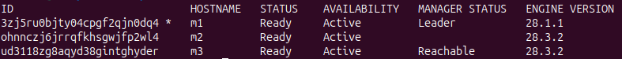
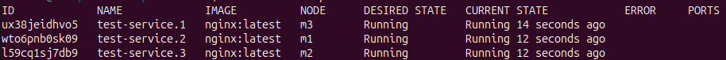
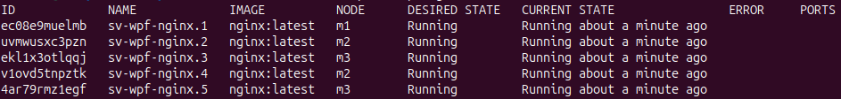
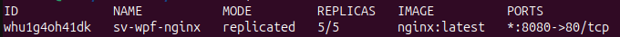
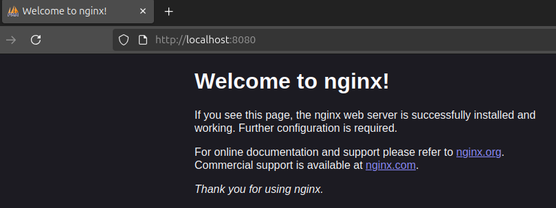
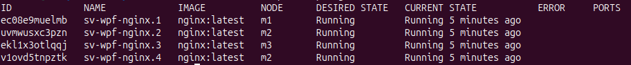
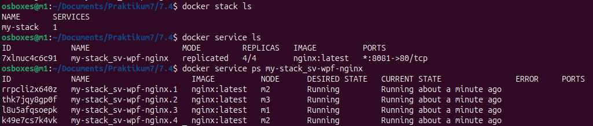

# Praktikum 7 - Nils Teipel

## Aufgabe 7.1

**Setzen Sie ein Docker Swarm Cluster mit drei Swarm Nodes auf! Dokumentieren Sie in der Aufgabenlösung die Ergebnisse der folgenden Teilaufgaben:**

1. Implementierungsschritt 1: Initialisieren Sie den Docker Swarm Cluster!
   - Command (m1): `docker swarm init --advertise-addr 192.168.2.225` Parameter, da ohne ein Fehler aufgetreten ist, da über den Netzadapter mehrere IPv6-Adressen laufen (warum auch immer)
   - Token: `SWMTKN-1-2ltq9cb0j2qzcjq27l8zmg6kq5ogf87ly74my13dl6da5k16pc-cp4u24ymmhpkbn6ki1q1kotp6`

2. Implementierungsschritt 2: Fügen Sie den zweiten Docker Host als Worker Node dem Docker Swarm Cluster hinzu!
    - Command (m2): `sudo docker swarm join --token SWMTKN-1-2ltq9cb0j2qzcjq27l8zmg6kq5ogf87ly74my13dl6da5k16pc-cp4u24ymmhpkbn6ki1q1kotp6 192.168.2.225:2377`

3. Implementierungsschritt 3: Fügen Sie den dritten Docker Hosts als Manager Node dem Docker Swarm Cluster hinzu!
    - Command (m1): `docker swarm join-token manager`
    - Token: `SWMTKN-1-2ltq9cb0j2qzcjq27l8zmg6kq5ogf87ly74my13dl6da5k16pc-01jjb6sjidzd03fc7ruzeucf9`
    - Command (m3): `sudo docker swarm join --token SWMTKN-1-2ltq9cb0j2qzcjq27l8zmg6kq5ogf87ly74my13dl6da5k16pc-01jjb6sjidzd03fc7ruzeucf9 192.168.2.225:2377` 

4. Zeigen Sie, dass Ihr Swarm Cluster nach den Schritten 1 bis 3 ein Swarm Cluster mit drei Nodes ist (2 Manager, 1 Worker)!
    - Command (m1): `sudo docker node ls` <br>
    

5. Geben Sie an, wie Sie ermitteln können, welcher der Nodes des Swarm Clusters der aktuelle Leader ist!
    - Siehe Bild 7.1.1. Bei `Manager Status`

---

## Aufgabe 7.2

**Verwenden Sie für die Durchführung der folgenden Aufgabe den in 7.1 aufgesetzten Docker Swarm Cluster!**

1. Konfigurieren Sie den Swarm Cluster so, dass alle Nodes (Manager und Worker)Container hosten können! Geben Sie an, welche Schritte Sie dazu durchgeführt haben!
    - Das ist Standardmäßig so eingestellt

2. Weisen Sie nach, dass alle Nodes im Swarm Container hosten können!
    - Command (m1): `docker service create --name test-service --replicas 3 nginx:latest`
    - Command (m1): `docker service ps test-service` <br>
    
   
3. Beantworten Sie die folgende Frage: Wie viele Manager Nodes dürfen im aufgesetzten Swarm Cluster (Schritte 1 bis 3 aus 7.1) ausfallen, damit Ihr Swarm Cluster noch verwaltet werden kann?
    - Keiner, da wir nur 2 Manager-Nodes haben und es immer mehr als 50% Manager-Nodes geben muss

4. Beantworten Sie die folgende Frage: Wie können Sie aus einem Worker Node einen Manager Node machen, ohne den Worker Node aus dem Swarm Cluster zu entfernen?
    - Mit dem Command `docker node promote <ID oder Hostname>`

---

## Aufgabe 7.3

**Setzen Sie in Ihrem Docker Swarm Cluster mithilfe von „docker service“ einen Service mit folgenden Eigenschaften auf:**
    <br> a. Der Service verwendet das offizielle nginx-Image von Docker Hub.
    <br> b. Der Service wird mit fünf Replicas ausgerollt.
    <br> c. Von Ihrem lokalen Docker Host ist der Service über Port 8080 erreichbar.
    <br> d. Der Name des Service lautet „sv-wpf-nginx“.

Command (m1): `docker service create --name sv-wpf-nginx --replicas 5 -p 8080:80 nginx:latest`

1. Weisen Sie nach, dass der unter 1. aufgesetzte nginx-Service die Eigenschaften a) bis d) besitzt!
    - Command (m1): `docker service ps sv-wpf-nginx` <br>
    
    - Command (m1): `docker service ls` <br>
    

2. Weisen Sie nach, dass der unter 1. aufgesetzte nginx-Service tatsächlich zur Verfügung steht! <br>
    

3. Verändern Sie den Service, sodass er mit 4 statt 5 Replicas läuft! Muss der Service dazu gelöscht und (verändert) neu gestartet werden?
   - Command (m1): `docker service scale sv-wpf-nginx=4`
   - Command (m1): `docker service ps sv-wpg-nginx` <br>
    

---

## Aufgabe 7.4

**Setzen Sie in Ihrem Swarm mithilfe von „docker stack deploy“ einen Service mit folgenden Eigenschaften auf:**        
    <br> a. Der Service verwendet das offizielle nginx-Image von Docker Hub.
    <br> b. Der Service wird mit vier Replicas ausgerollt.
    <br> c. Von Ihrem lokalen Docker Host ist der Service über Port 8081 erreichbar.
    <br> d. Der Name des Services im der Konfigurationsdatei (compose-File) lautet „sv-wpf-nginx“.

````yaml
services:
  sv-wpf-nginx:
    image: nginx:latest
    ports:
      - "8081:80"
    deploy:
      replicas: 4
    networks:
      - overlay_net

networks:
  overlay_net:
    driver: overlay
````

Command (m1): `docker stack deploy -c nginx-stack.yaml my-stack` <br>



1. Wie heißt Ihr Service im Kontext Docker Swarm?
    - Name: `my-stack_sv-wpf-nginx`
2. Wie kommt der Name des Services zustande?
    - Der Name setzt sich aus dem Namen des Stacks (my-stack) und dem Namen des Services (sv-wpf-nginx) zusammen
3. Ist es ein Problem, wenn der Service aus Aufgabe 7.3 noch läuft, wenn Sie den Stack starten? Erläutern Sie Ihre Antwort!
   - Kein technisches Problem, da die Services auf verschiedenen Ports laufen
   - Es kann zu Verwirrungen führen, da die Namen sich sehr ähneln
