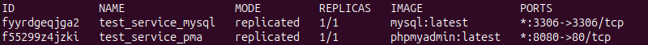

# Praktikum 8 - Nils Teipel

## Aufgabe 8.1

1. **Auf jedem Node des Docker Swarm Clusters soll genau ein Task bzw. eine Replica des Services laufen.**
````yaml
services:
  nginx1:
    image: nginx:latest
    ports:
      - "8080:80"
    deploy:
      mode: global
````
Command (m1): `docker stack deploy -c 1.yaml nginx_1` <br>
Command (m1): `docker service ps nginx_1_nginx1` <br>


2. **Es sollen 3 Replicas für den Service laufen**
````yaml
services:
  nginx2:
    image: nginx:latest
    ports:
      - "8081:80"
    deploy:
      replicas: 3
````
Command (m1): `docker stack deploy -c 2.yaml nginx_2` <br>
Command (m1): `docker service ps nginx_2_nginx2` <br>


3. **Auf jedem Node sollen jeweils maximal 2 Replicas laufen, wobei für den Service insgesamt 5 Replicas gestartet werden.**
````yaml
services:
  nginx3:
    image: nginx:latest
    ports:
      - "8082:80"
    deploy:
      replicas: 5
      placement:
        max_replicas_per_node: 2
````
Command (m1): `docker stack deploy -c 3.yaml nginx_3` <br>
Command (m1): `docker service ps nginx_3_nginx3` <br>


4. **Die für den Service gestarteten Replicas sollen immer nur auf einem bestimmten Node(z.B. Node 2) laufen. Dies soll auch dann gelten, wenn der Service gelöscht und wieder neu erzeugt wird.** 
Command (m1): `docker node update --label-add hostname=m2 m2` 
````yaml
services:
  nginx4:
    image: nginx:latest
    ports:
      - "8083:80"
    deploy:
      replicas: 2
      placement:
       constraints:
         - node.labels.hostname == m2
````
Command (m1): `docker stack deploy -c 4.yaml nginx_4` <br>
Command (m1): `docker service ps nginx_4_nginx4` <br>


5. **Unabhängig davon, wie viele Replicas gestartet werden, ein bestimmter Node (z.B. Node 3) erhält nie eine Replica zugewiesen.**
Command (m1): `docker node update --label-add excluded=true m3`
````yaml
services:
  nginx5:
    image: nginx:latest
    ports:
      - "8084:80"
    deploy:
      replicas: 2
      placement:
       constraints:
         - node.labels.excluded != true
````
Command (m1): `docker stack deploy -c 5.yaml nginx_5` <br>
Command (m1): `docker service ps nginx_5_nginx5` <br>


**Überblick** <br>


---

## Aufgabe 8.2

1. **Rollen Sie die aus einer früheren Aufgabe bekannten Services phpMyAdmin und MySQL im Docker Swarm Cluster aus! Sorgen Sie dabei dafür, dass der MySQL-Task stets auf demselben Node des Docker Swarm Clusters ausgeführt wird! Dokumentieren Sie die von Ihnen verwendete Konfigurationsdatei (Compose-Datei)!**

````yaml
services:
  mysql:
    image: mysql:latest
    environment:
      MYSQL_ROOT_PASSWORD: pw
      MYSQL_DATABASE: my_database
    ports:
      - "3306:3306"
    volumes:
      - mysql_data:/var/lib/mysql
    deploy:
      replicas: 1
      placement:
        constraints:
          - node.labels.mysql == true

  pma:
    image: phpmyadmin:latest
    environment:
      PMA_HOST: mysql
      MYSQL_ROOT_PASSWORD: pw
    ports:
      - "8080:80"
    depends_on:
      - mysql
    deploy:
      replicas: 1

volumes:
  mysql_data:
````
Command (m1): `docker node update --label-add mysql=true m3` <br>
Command (m1): `docker stack deploy -c compose.yaml test.service` <br>
Command (m1): `docker service ls` <br>


2. **Beschreiben Sie, was geschehen kann, wenn der MySQL-Task im Laufe der Zeit auf unterschiedlichen Nodes des Docker Swarm Clusters gestartet würde**
    - Die Datenspeicherung wäre nicht mehr persistent, da die Daten immer auf den Nodes gespeichert werden. Daher ist es besser im dedizierte Nodes für die Datenverwaltung zu haben.

---

## Aufgabe 8.3

**Beantworten Sie die folgende Frage: Wie müssen Sie vorgehen, um einen Service, der auf einem selbst erzeugten Image beruht, im Docker Swarm Cluster starten zu können?**
- Docker Swarm kennt die Build-Direktive über eine Dockerfile nicht. Daher müssen Images immer aus einer Registry (privat/öffentlich) gezogen werden. 
- Liegt ein Image nur lokal auf einem Node, kann es von den anderen nicht benutzt werden

---

## Aufgabe 8.4

**Konzipieren und implementieren Sie eine Docker Swarm Cluster-Umgebung mit drei Nodes(2 x Manager, 1 x Worker) und einem Service mit den folgenden Eigenschaften:**
    <br> a) Um den Service auszurollen, verwenden Sie ein selbst generiertes Image. Das selbst generierte Image erzeugt einen Container mit dem Apache Web-Server (httpd), der bei Abrufen der Webseite den Hostnamen des Containers ausgibt.
    <br> b) Auf jedem der Nodes läuft mindestens eine Replica.
    <br> c) Der Service ist von außen unter Port 8088 erreichbar.
    <br> d) Der Service hat den Namen „sv-wpf-apache“.

- Als Image benutze ich das zuvor erstellte Image aus Aufgabe 5.4 Hier wird auch ein Apache-Server gestartet, der die Host-ID auf einer Website anzeigt.
- Image: `localhost:5000/my-repo:V1.0` Dies liegt bereits in der in 5.4 erstellten Registry -> Registry zu m2 und m3 in der `daemon.json` hinzufügen

````yaml
services:
  sv-wpf-apache:
    image: m1:5000/my-repo:V1.0
    ports:
      - "8088:80"
    deploy:
      replicas: 3
````
Command (m1): `docker stack deploy -c docker-compose.yaml apache-service` <br>
Command (m1): `docker service ps apache-serivce_sv-wpf-apache` <br>


- Über alle Nodes erreichbar: <br>


Sie können Ihre eigene Registry auch als Service im Swarm Cluster aufsetzen und nicht als eigenständige Registry außerhalb des Swarm Clusters. Welche Konsequenzen ergeben sich daraus? Warum ist dieser Ansatz als genereller Ansatz problematisch?
- "Henne-Ei-Problem": Eine Registry ist eine Infrastrukturkomponente und sollte verfügbar sein, bevor ein Stack deployt wird
- Unnötig Komplex, da für jeden Stack eine eigene Registry benutzt wird, was auch zu redundanten Daten führen kann

---

## Aufgabe 8.5
1. **Beenden Sie den Service „sv-wpf-apache“ und setzen Sie ihn neu auf, sodass er nur noch auf den beiden Manager Nodes läuft!**
    - Command (m1): `docker service rm apache-service_wv-wpf-apache`
    - Command (m1): `docker node upate --label-add excluded=true m3`

````yaml
services:
  sv-wpf-apache:
    image: m1:5000/my-repo:V1.0
    ports:
      - "8088:80"
    deploy:
      replicas: 3
      placement:
        constraints:
          - node.labels.excluded != true
````
Command (m1): `docker stack deploy -c docker-compose.yaml apache-service` <br>
Command (m1): `docker service ps apache-service_sv-wpf-apache` <br>


2. **Verbinden Sie sich mit Port 8088 auf dem Worker Node! Was stellen Sie jetzt fest?**
    - Ich sehe trotzdem die Seite mit dem Hostnamen
   
3. **Erklären Sie das unter 2. festgestellte Verhalten!**
    - Das ist wegen des Ingress-Routing-Mesh.
    - Docker macht die Services bei veröffentlichten Ports über jeden Node erreichbar
